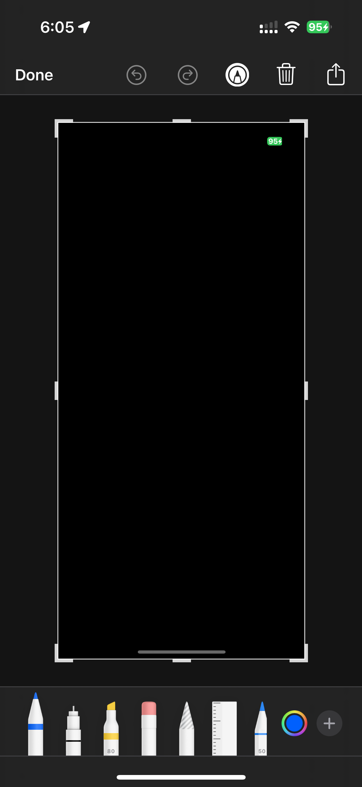

<h1 align="center">Secure Content</h1>

<p align="center">Protect sensitive Flutter UI from screenshots, recording visibility, app switcher previews, and runtime risk states on Android and iOS.</p><br>

<p align="center">
  <a href="https://flutter.dev">
    
  </a>
  <a href="https://pub.dartlang.org/packages/secure_content">
    
  </a>
  <a href="https://opensource.org/licenses/MIT">
    
  </a>
</p><br>

## Screenshots

<details>
  <summary>Android - Screen recording demo</summary>

https://user-images.githubusercontent.com/60510869/154502746-830d9198-8f11-46ba-9246-784def00f610.mp4

</details>

<details>
  <summary>iOS - Screenshot result</summary>



</details>

<details>
  <summary>iOS - Screen recording demo</summary>

https://github.com/user-attachments/assets/0b4e10ac-d592-4b5b-92bf-72f51b2cf570

</details>

<details>
  <summary>iOS - App switcher demo</summary>

https://github.com/user-attachments/assets/b6ef5914-eb3a-4e17-be0c-2f00538cffec

</details>

## Features

- Screenshot prevention and recording obscuring
- App switcher protection with configurable color and optional branding image (iOS)
- Android 14+ screenshot callback support
- Biometric/device credential re-auth hooks
- Inactivity auto-lock for secure areas
- Integrity risk checks (root/jailbreak/debugger/emulator heuristics)
- Soft mode events and optional hard-block mode
- Sensitive clipboard with TTL-based auto-clear
- Risk-state watermark overlay (only shown when needed)

## Installation

```yaml
dependencies:
  secure_content: ^2.0.0-beta.4
```

## Quick Start

```dart
import 'package:flutter/material.dart';
import 'package:secure_content/secure_content.dart';

SecureContentScope(
  enabled: true,
  protectInAppSwitcher: true,
  appSwitcherColor: Colors.black,
  policy: const SecureContentPolicy(
    requireBiometricOnResume: true,
    inactivityTimeout: Duration(seconds: 30),
    enableIntegrityChecks: true,
    hardBlockOnIntegrityRisk: false,
    enableRiskWatermark: true,
    watermarkText: 'CONFIDENTIAL',
  ),
  onEvent: (event) {
    debugPrint('Secure event: ${event.type.name}');
  },
  child: const YourSensitiveWidget(),
)
```

## App Switcher Branding (iOS)

When the app moves to the background, the multitasking snapshot and biometric
re-auth moment are covered by a privacy overlay. By default this is a flat
`appSwitcherColor` fill. Pass `appSwitcherImageName` to center one of your host
app's native asset-catalog images on that overlay, rendered as a white-tinted
template, so the snapshot shows your branding instead:

```dart
SecureContentScope(
  enabled: true,
  protectInAppSwitcher: true,
  appSwitcherColor: Colors.black,
  // Name of an image in the iOS app's asset catalog (Assets.xcassets).
  appSwitcherImageName: 'AppSwitcherLogo',
  child: const YourSensitiveWidget(),
)
```

> Note: `appSwitcherImageName` is iOS-only. On Android the app-switcher overlay
> uses `appSwitcherColor`; the image name is ignored.

## Global Protection

```dart
await SecureContent.setGlobalProtection(
  true,
  protectInAppSwitcher: true,
  appSwitcherColor: Colors.black,
);
```

## Clipboard TTL

```dart
await SecureContent.setSensitiveClipboard(
  'one-time code: 123456',
  clearAfter: const Duration(seconds: 10),
);
```

## Events

Listen to all secure events globally:

```dart
SecureContent.events.listen((event) {
  debugPrint('Secure event: ${event.type.name}');
});
```

Key event types include:
- `screenshotCaptured`
- `recordingStarted` / `recordingStopped`
- `biometricAuthSucceeded` / `biometricAuthFailed` / `biometricUnavailable`
- `integritySafe` / `integrityRiskDetected`
- `clipboardSet` / `clipboardCleared`
- `idleLockActivated` / `idleLockReleased`

## Platform Support

| Feature                         | iOS | Android |
| ------------------------------- | --- | ------- |
| Screenshot Prevention           | ✅  | ✅      |
| Screen Recording Prevention     | ✅  | ✅      |
| Screenshot Detection Callback   | ✅  | ✅ (Android 14+) |
| Screen Recording Start Callback | ✅  | ❌      |
| Screen Recording Stop Callback  | ✅  | ❌      |
| Biometric Re-Auth               | ✅  | ✅      |
| Inactivity Auto-Lock            | ✅  | ✅      |
| Integrity Risk Check            | ✅  | ✅      |
| Hard Block Mode                 | ✅  | ✅      |
| Sensitive Clipboard TTL         | ✅  | ✅      |
| Risk-State Watermark            | ✅  | ✅      |
| App Switcher Protection         | ✅  | ✅      |
| Dynamic Security Toggle         | ✅  | ✅      |
| Full App Protection             | ✅  | ✅      |

## Notes

- Android screenshot callback requires Android 14+.
- Android system clipboard "Copied to clipboard" toast is controlled by the OS and cannot be disabled by apps.
- Integrity checks are heuristic signals, not a guaranteed anti-tamper boundary.

## Example

See `example/lib/main.dart` for a complete implementation including:
- global protection toggle
- biometric trigger
- integrity check trigger
- clipboard TTL action
- hard-block mode toggle
- secure scope with policy

## License

This project is licensed under the MIT License - see the [LICENSE](LICENSE) file for details.
