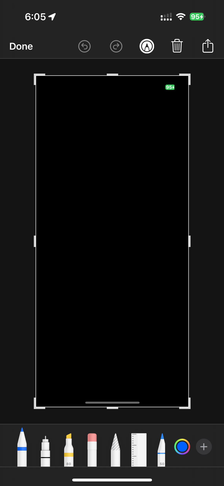

<h1 align="center">Secure Content</h1>

<p align="center">Protect sensitive Flutter UI from recording visibility, app switcher previews, and runtime risk states on Android and iOS. On iOS, screenshot events are detected and reported.</p><br>

<p align="center">
  <a href="https://flutter.dev">
    
  </a>
  <a href="https://pub.dartlang.org/packages/secure_content">
    
  </a>
  <a href="https://opensource.org/licenses/MIT">
    
  </a>
</p><br>

## Screenshots

<details>
  <summary>Android - Screen recording demo</summary>

https://user-images.githubusercontent.com/60510869/154502746-830d9198-8f11-46ba-9246-784def00f610.mp4

</details>

<details>
  <summary>iOS - Screenshot detection result</summary>



</details>

<details>
  <summary>iOS - Screen recording demo</summary>

https://github.com/user-attachments/assets/0b4e10ac-d592-4b5b-92bf-72f51b2cf570

</details>

<details>
  <summary>iOS - App switcher demo</summary>

https://github.com/user-attachments/assets/b6ef5914-eb3a-4e17-be0c-2f00538cffec

</details>

## Features

- Screenshot detection and recording obscuring
- App switcher protection with configurable color and optional branding image (iOS)
- Android 14+ screenshot callback support
- Biometric/device credential re-auth hooks
- Inactivity auto-lock for secure areas
- Integrity risk checks (root/jailbreak/debugger/emulator heuristics)
- Soft mode events and optional hard-block mode
- Sensitive clipboard with TTL-based auto-clear
- Risk-state watermark overlay (only shown when needed)

## Installation

Requires Flutter 3.44+, Dart 3.11+, Android API 23+, and iOS 13+.
Android host apps must compile against SDK 37 or later. The example uses AGP 9.3.3.
The example and CI use Flutter 3.47.4, which requires iOS 15+. See the
[native toolchain](docs/native-toolchain.md) for compiler versions and compatibility.
AndroidX Core is constrained to 1.17.0 because newer releases remove the
fingerprint implementation required by stable Biometric on Android 23–27.

```yaml
dependencies:
  secure_content: ^2.1.0
```

For Face ID authentication, add a usage description to the host app's
`ios/Runner/Info.plist`:

```xml
<key>NSFaceIDUsageDescription</key>
<string>Authenticate to access protected content.</string>
```

For biometric authentication on Android 23–27, the host activity must extend
`FlutterFragmentActivity`. The example uses this activity on all Android versions:

```kotlin
import io.flutter.embedding.android.FlutterFragmentActivity

class MainActivity : FlutterFragmentActivity()
```

On Android 23–27, the activity theme must also inherit from
`Theme.AppCompat.DayNight.NoActionBar` or another AppCompat theme. Set this parent
for `LaunchTheme` and `NormalTheme` in both `values/styles.xml` and
`values-night/styles.xml`. The example includes these themes.

## Quick Start

```dart
import 'package:flutter/material.dart';
import 'package:secure_content/secure_content.dart';

SecureContentScope(
  enabled: true,
  protectInAppSwitcher: true,
  appSwitcherColor: Colors.black,
  policy: const SecureContentPolicy(
    requireBiometricOnResume: true,
    inactivityTimeout: Duration(seconds: 30),
    enableIntegrityChecks: true,
    hardBlockOnIntegrityRisk: false,
    enableRiskWatermark: true,
    watermarkText: 'CONFIDENTIAL',
  ),
  onEvent: (event) {
    debugPrint('Secure event: ${event.type.name}');
  },
  child: const YourSensitiveWidget(),
)
```

## Scope and Native Protection

`SecureContentScope` scopes the Flutter overlay, lock screen, and risk
watermark to its `child`. When the scope is enabled, it also enables native
capture protection for the current app window. Native protection is not
limited to the scope's `child`.

While a scope is locked or hard-blocked, its child cannot receive focus,
pointer input, or accessibility actions. Its accessibility content is hidden
until access is restored. Custom lock and hard-block builders must paint an
opaque cover that fills the scope.

## App Switcher Branding (iOS)

On iOS, when the app moves to the background, the multitasking snapshot and
biometric re-auth moment are covered by a privacy overlay. By default this is
a flat `appSwitcherColor` fill. Pass `appSwitcherImageName` to center one of
your host app's native asset-catalog images on that overlay, rendered as a
white-tinted template:

```dart
SecureContentScope(
  enabled: true,
  protectInAppSwitcher: true,
  appSwitcherColor: Colors.black,
  // Name of an image in the iOS app's asset catalog (Assets.xcassets).
  appSwitcherImageName: 'AppSwitcherLogo',
  child: const YourSensitiveWidget(),
)
```

The native iOS privacy cover always uses an opaque background. The alpha
component of `appSwitcherColor` does not make protected content visible.

> Note: `appSwitcherImageName` is iOS-only. Android uses `FLAG_SECURE` for
> capture and app-switcher protection. When `protectInAppSwitcher` is true,
> Android also sets the navigation-bar color to `appSwitcherColor`. Android
> does not add a branded app-switcher overlay, and it ignores the image name.

## Global Protection

```dart
await SecureContent.setGlobalProtection(
  true,
  protectInAppSwitcher: true,
  appSwitcherColor: Colors.black,
);
```

## Clipboard TTL

```dart
await SecureContent.setSensitiveClipboard(
  'one-time code: 123456',
  clearAfter: const Duration(seconds: 10),
);
```

iOS uses system pasteboard expiration and keeps sensitive copies local to the
device. Automatic cleanup preserves newer clipboard entries, including a new
copy of the same text. A zero or negative `clearAfter` disables automatic expiry.

Android restricts clipboard access while an app is in the background. If cleanup
cannot access the clipboard, it remains pending until the app can access it
again. The requested TTL is not a guaranteed background deletion deadline on
Android. Process termination can also prevent app-scheduled cleanup.

## Events

Listen to all secure events globally:

```dart
SecureContent.events.listen((event) {
  debugPrint('Secure event: ${event.type.name}');
});
```

Key event types include:
- `screenshotCaptured`
- `recordingStarted` / `recordingStopped`
- `biometricAuthSucceeded` / `biometricAuthFailed` / `biometricUnavailable`
- `integritySafe` / `integrityRiskDetected`
- `clipboardSet` / `clipboardCleared`
- `idleLockActivated` / `idleLockReleased`

## Platform Support

| Feature                         | iOS | Android |
| ------------------------------- | --- | ------- |
| Screenshot Prevention           | ❌  | ✅      |
| Screen Recording Obscuring      | ✅  | ✅      |
| Screenshot Detection Callback   | ✅  | ✅ (Android 14+) |
| Screen Recording Start Callback | ✅  | ❌      |
| Screen Recording Stop Callback  | ✅  | ❌      |
| Biometric Re-Auth               | ✅  | ✅      |
| Inactivity Auto-Lock            | ✅  | ✅      |
| Integrity Risk Check            | ✅  | ✅      |
| Hard Block Mode                 | ✅  | ✅      |
| Sensitive Clipboard TTL         | ✅  | ✅      |
| Risk-State Watermark            | ✅  | ✅      |
| App Switcher Protection         | ✅  | ✅      |
| Dynamic Security Toggle         | ✅  | ✅      |
| Full App Protection             | ✅  | ✅      |

## Notes

- Android screenshot callback requires Android 14+.
- Visual capture protection does not mute audio in a screen recording. Mute
  audio separately in the recording or media layer.
- Android system clipboard "Copied to clipboard" toast is controlled by the OS and cannot be disabled by apps.
- Integrity checks are heuristic signals, not a guaranteed anti-tamper boundary.
- The iOS plugin supports CocoaPods and Swift Package Manager. Its native
  window integration uses UIKit; it does not require SwiftUI.

## Example

See `example/lib/main.dart` for a complete implementation including:
- global protection toggle
- biometric trigger
- integrity check trigger
- clipboard TTL action
- hard-block mode toggle
- secure scope with policy

## License

This project is licensed under the MIT License - see the [LICENSE](LICENSE) file for details.
